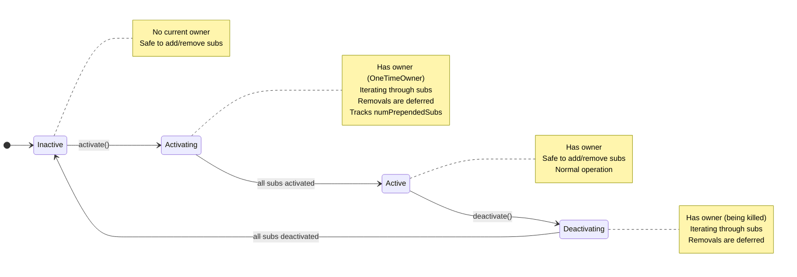

## Why State Machine?

The original implementation uses multiple boolean flags that must be kept in sync:

| Original Flags | Problem |
|----------------|---------|
| `isSafeToRemoveSubscription` | Boolean doesn't tell you *why* it's unsafe |
| `_maybeCurrentOwner.isDefined` | Conflates "has owner" with "is active" |
| `numPrependedSubs` | Only valid during activation |

With a state machine, **invalid states become unrepresentable**.

### Hybrid Approach

This implementation uses **singleton `case object`s** for states (zero allocation on transitions) while keeping mutable data in separate fields. Best of both worlds:

## State Machine Design



## Hybrid State Machine Implementation

States are **singleton objects** (no allocation), while mutable data is stored in separate fields:

```scala title="DynamicOwnerState.scala"
package com.raquo.airstream.ownership

/**
  * Explicit states for DynamicOwner lifecycle.
  * All states are singleton objects - zero allocation on state transitions!
  */
sealed trait DynamicOwnerState

object DynamicOwnerState {
  /** Not active, no current owner */
  case object Inactive extends DynamicOwnerState

  /** Currently iterating through subscriptions to activate them */
  case object Activating extends DynamicOwnerState

  /** Fully active with a current owner */
  case object Active extends DynamicOwnerState

  /** Currently iterating through subscriptions to deactivate them */
  case object Deactivating extends DynamicOwnerState
}
```

```scala title="DynamicOwnerHybrid.scala"
package com.raquo.airstream.ownership

import com.raquo.airstream.core.Transaction
import com.raquo.ew.JsArray
import DynamicOwnerState._

/** DynamicOwner manages [[DynamicSubscription]]-s similarly to how Owner manages `Subscription`s,
  * except `DynamicSubscription` can be activated and deactivated repeatedly.
  *
  * This version uses an explicit state machine with zero-allocation transitions.
  * States are singletons, mutable data is stored separately.
  *
  * @param onAccessAfterKilled
  *          Called if you attempt to use any Owner created by this DynamicOwner
  *          after that Owner was killed.
  */
class DynamicOwner(onAccessAfterKilled: () => Unit) {

  private[this] val subscriptions: JsArray[DynamicSubscription] = JsArray()
  private val pendingSubscriptionRemovals: JsArray[DynamicSubscription] = JsArray()

  // ============ State Machine ============

  /** Current state - transitions between singletons, no allocation */
  private var state: DynamicOwnerState = Inactive

  /** Current owner reference - None when Inactive */
  private var _maybeCurrentOwner: Option[OneTimeOwner] = None

  /** Prepend counter - only meaningful during Activating state */
  private var _numPrependedSubs: Int = 0

  // ============ Public API ============

  @inline def maybeCurrentOwner: Option[Owner] = _maybeCurrentOwner

  @inline def isActive: Boolean = state != Inactive

  /** True when in a transitional state (Activating or Deactivating) */
  @inline def isTransitioning: Boolean =
    state == Activating || state == Deactivating

  @inline def hasSubscriptions: Boolean = subscriptions.length != 0

  @inline def numSubscriptions: Int = subscriptions.length

  def activate(): Unit = {
    state match {
      case Inactive =>
        Transaction.onStart.shared {
          val newOwner = new OneTimeOwner(onAccessAfterKilled)
          _maybeCurrentOwner = Some(newOwner)
          _numPrependedSubs = 0
          state = Activating  // No allocation!

          var i = 0
          val originalNumSubs = subscriptions.length

          while (i < originalNumSubs) {
            val ix = i + _numPrependedSubs
            subscriptions(ix).onActivate(newOwner)
            i += 1
          }

          removePendingSubscriptionsNow()
          state = Active  // No allocation!
          _numPrependedSubs = 0
        }

      case Active =>
        throw new Exception(s"Can not activate $this: already active")

      case Activating =>
        throw new Exception(s"Can not activate $this: activation in progress")

      case Deactivating =>
        throw new Exception(s"Can not activate $this: deactivation in progress")
    }
  }

  def deactivate(): Unit = {
    state match {
      case Active =>
        state = Deactivating  // No allocation!

        subscriptions.forEach(_.onDeactivate())
        removePendingSubscriptionsNow()

        _maybeCurrentOwner.foreach(_._killSubscriptions())
        removePendingSubscriptionsNow()

        _maybeCurrentOwner = None
        state = Inactive  // No allocation!

      case Inactive =>
        throw new Exception("Can not deactivate DynamicOwner: not active")

      case Deactivating =>
        throw new Exception("Can not deactivate DynamicOwner: deactivation in progress")

      case Activating =>
        throw new Exception("Can not deactivate DynamicOwner: activation in progress")
    }
  }

  // ============ Internal API ============

  private[ownership] def addSubscription(subscription: DynamicSubscription, prepend: Boolean): Unit = {
    if (prepend) {
      if (state == Activating) _numPrependedSubs += 1
      subscriptions.unshift(subscription)
    } else {
      subscriptions.push(subscription)
    }

    _maybeCurrentOwner.foreach { owner =>
      subscription.onActivate(owner)
    }
  }

  private[ownership] def removeSubscription(subscription: DynamicSubscription): Unit = {
    if (isTransitioning) {
      pendingSubscriptionRemovals.push(subscription)
    } else {
      removeSubscriptionNow(subscription)
    }
  }

  private[this] def removeSubscriptionNow(subscription: DynamicSubscription): Unit = {
    val index = subscriptions.indexOf(subscription)
    if (index != -1) {
      subscriptions.splice(index, deleteCount = 1)
      if (isActive) {
        subscription.onDeactivate()
      }
    } else {
      throw new Exception("Can not remove DynamicSubscription from DynamicOwner: subscription not found.")
    }
  }

  private[this] def removePendingSubscriptionsNow(): Unit = {
    while (pendingSubscriptionRemovals.length > 0) {
      removeSubscriptionNow(pendingSubscriptionRemovals.shift())
    }
  }
}
```

## Key Improvements

### 1. Zero-Allocation State Transitions

States are singleton `case object`s - no heap allocation when transitioning:

```scala
state = Activating  // Just a reference assignment, no `new`
state = Active      // Same object every time
state = Inactive    // No GC pressure
```

### 2. Clear State + Mutable Data Separation

```scala
// State enum - controls flow
private var state: DynamicOwnerState = Inactive

// Mutable data - stored separately
private var _maybeCurrentOwner: Option[OneTimeOwner] = None
private var _numPrependedSubs: Int = 0
```

### 3. Better Error Messages

Before: Generic error
```scala
throw new Exception(s"Can not activate $this: it is already active")
```

After: Specific error per state
```scala
case Activating =>
  throw new Exception(s"Can not activate $this: activation in progress")
case Deactivating =>
  throw new Exception(s"Can not activate $this: deactivation in progress")
```

### 4. Self-Documenting State Checks

Before: What does this mean?
```scala
if (isSafeToRemoveSubscription) { ... }
```

After: Intent is clear
```scala
@inline def isTransitioning: Boolean =
  state == Activating || state == Deactivating

if (isTransitioning) { ... }
```

### 5. Guarded Mutable Access

The `_numPrependedSubs` is only modified when state is `Activating`:

```scala
if (state == Activating) _numPrependedSubs += 1
```

### 6. Easy Debugging

```scala
println(s"DynamicOwner state: $state, owner: $_currentOwner")
// Output: "DynamicOwner state: Activating, owner: OneTimeOwner@abc"
```

## Comparison: Original vs Pure State Machine vs Hybrid

| Aspect | Original | Pure State Machine | Hybrid |
|--------|----------|-------------------|--------|
| Memory | ~12 bytes (3 primitives) | 24+ bytes per transition | ~16 bytes (similar to original) |
| Allocations | None | Per state change | **None** |
| GC pressure | None | Yes | **None** |
| Type safety | Weak (booleans) | Strong | **Strong** |
| Error messages | Generic | Specific | **Specific** |
| Pattern matching | Not used | Required | **Used where helpful** |
| Maintainability | Fragile | Clear | **Clear** |

The hybrid approach gives you **all the safety benefits with zero performance cost**.
